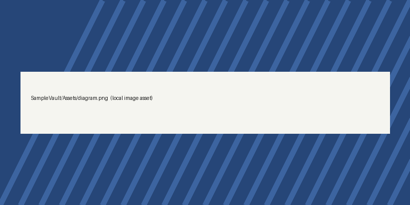

# Markdown Showcase

A tour of everything the viewer renders. Paragraphs wrap naturally and support **bold**, *italic*, ***both***, ~~strikethrough~~, `inline code`, and [external links](https://github.com).

## Lists

- First item
- Second item with **emphasis**
  - Nested item
    - Deeper still
- Third item

1. Clone the repository
2. Open the vault
3. Read your notes

- [x] Render Markdown
- [ ] Sync with GitHub

## Quote

> Simplicity is prerequisite for reliability.
>
> — Edsger W. Dijkstra

## Code

```swift
struct Note {
    let path: String
    let text: String
}
```

## Table

| Feature | Status | Phase |
|:--------|:------:|------:|
| Viewer | ✅ Done | 1 |
| Wiki links | ✅ Basic | 1 |
| GitHub sync | Planned — pull, detect changes, commit and push local edits | 2 |

---

## Images

A relative image path:



An Obsidian-style embed:

![[diagram.png]]

Back to [[README]].
